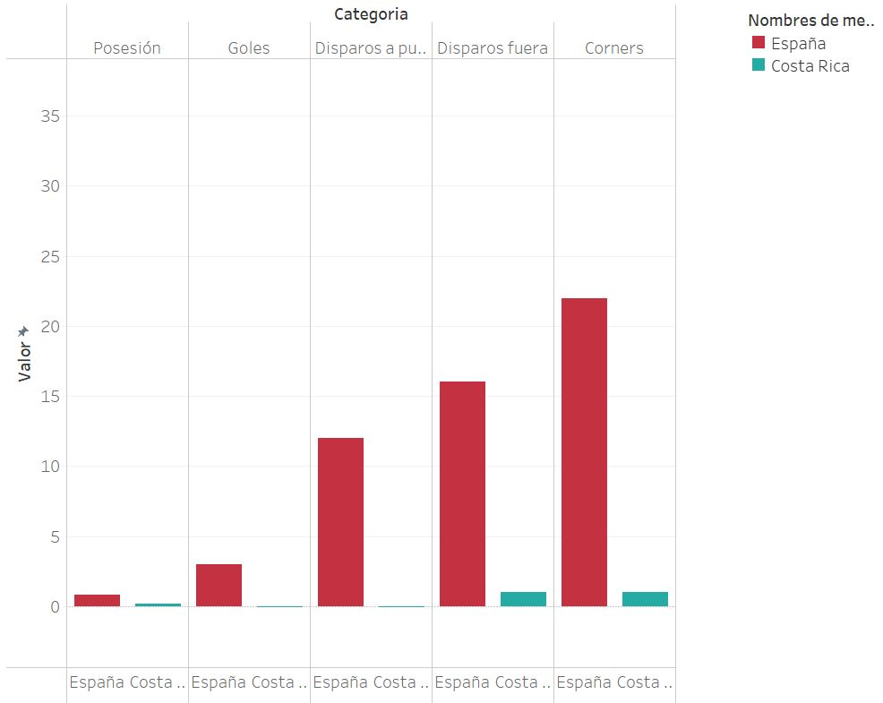
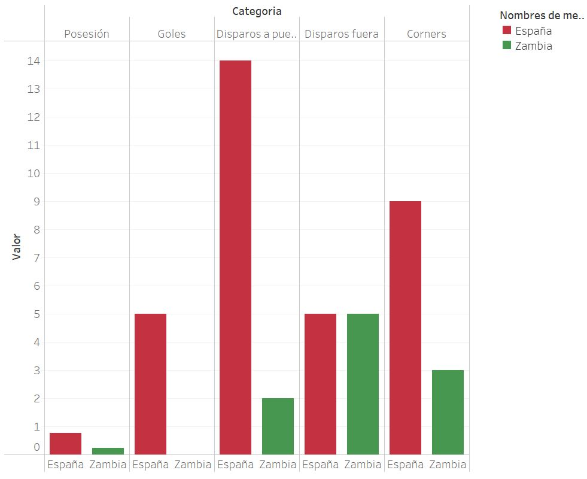
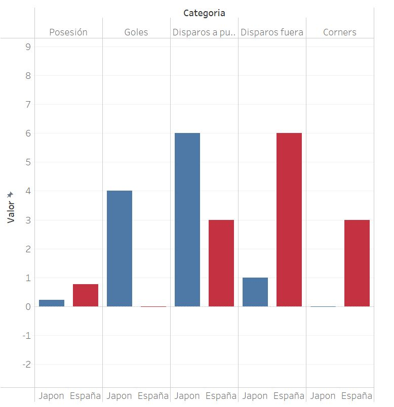
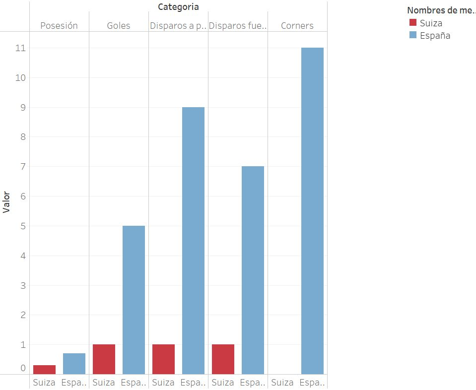
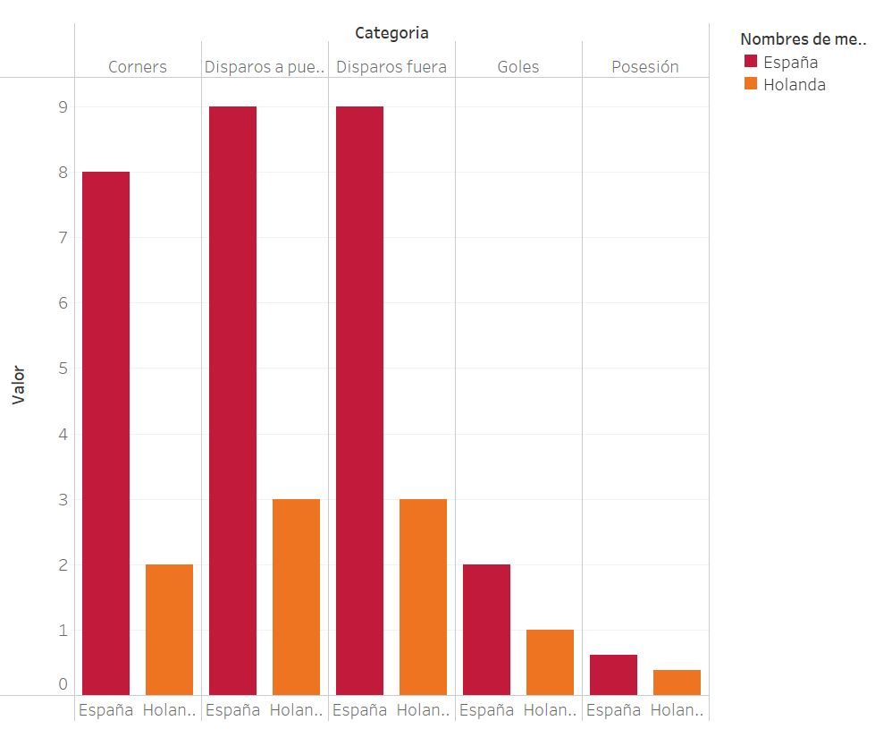

# Selección Española de Futbol Femenino en el Mundial de 2023

    

[https://public.tableau.com/app/profile/lola.del.brio.arias/viz/Lolaw5-visualization-project/EvolucindeEspaaenelMundial?publish=yes](https://public.tableau.com/app/profile/lola.del.brio.arias/viz/Lolaw5-visualization-project/EvolucindeEspaaenelMundial?publish=yes)

En este proyecto hemos tenido que realizar el analisis de unos datos para poder visualizarlos graficamente. He decidido escoger los datos del mundial femenino de futbol 2023, focalizandome solo en los partidos de España. Ya que se está disputando actualmente en el verano del 2023, solo hay ciertos datos, cuando acabe el mundial el 20 de agosto de 2023 podré hacer lo mismo pero con todos los datos.

Actualmente el equipo español se ha clasificado para pasar a las semifinales del torneo por lo que ha disputado 5 partidos en total, 3 de la fase de grupos, 1 de la eliminatoria de octavos y 2 de la eliminatoria de cuartos, habiendo conseguido en ellos 4 victorias y tan solo una derrota:
1. España vs. Costa Rica (3-0)
2. España vs. Zambia (5-0)
3. Japon vs. España (4-0)
4. Suiza vs. España (1-5)
5. España - Holanda (2-1)

## ETL
Para la extracción, la transformación y la carga de datos he escogido los datos del proyecto de la semana 4: w4-project-ETL que contenian los datos del partido contra Zambia, añadiendo los respectivos datos del resto de los partidos disputados por el conjunto español.
Se puede encontrar el proyecto de la semana 4 en el siguiente enlace: https://github.com/delbrioariasl/W4_ETL_Project

## Visualización
Para esta parte he realizado el mismo analisis para los 5 partidos disputados para facilitar el análisis y la comparación del rendimiento en cada partido:
1. España vs. Costa Rica (3-0)

2. España vs. Zambia (5-0)

3. Japon vs. España (4-0)

4. Suiza vs. España (1-5)

5. España - Holanda (2-1)

Despues de esto, he realizado dos gráficos evolutivos temporalmente que muestran la evolución de todos los equipos durante el mundial en cuanto a goles marcados y a victorias, lo normal es que al acabar el mundial el equipo vencedor aparezca en la cima de la segunda gráfica. 

1. Evolución de goles durante el torneo: https://flourish-user-preview.com/14737162/UC3PQ33OaqvxFTm6HAJt2z8Lmxcxm7SCREO2EwBiZRER2WIchSdhBsVEMGFfAB_a/
2. Evolución de victorias durante el torneo: https://flourish-user-preview.com/14734455/4qXfKqSRCc8U3zqiO3J2Hrt_r4CAfHrJ5IhyKmoOOZzsaBw_7hmXpX_mMlXkYAaY/

